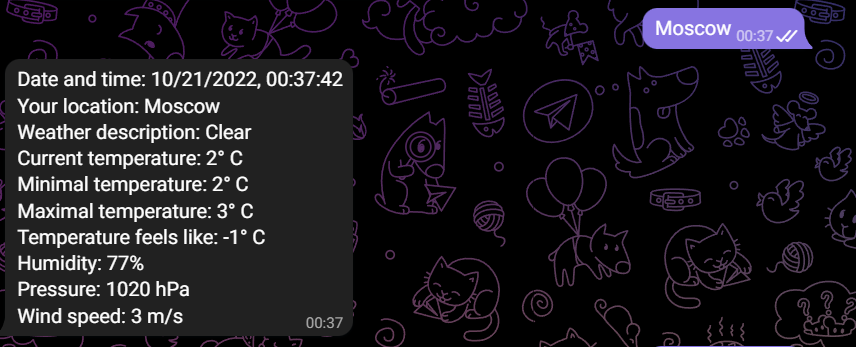
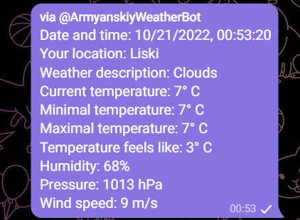

**Armenian weather bot**
============================================================

This bot would be helpful for everyone who wants to find out
the weather condition at any place on Earth. Temperature, pressure, humidity - 
all this information and even more will be available for users.

Our teammate Ruben was an idea-tor of this project. The bot was respectively written off his real life behavior.

---
Our project uses 4 libraries:
1. datetime
2. requests
3. telegram
4. telegram.ext

Bot uses 2 Tokens (я бы хотел, чтобы за них пояснили вы)

Bot consists of a list of functions:

- start
> This function receive a "start message" and send the greetings to the user.
> 
> 

- unknown
> If user enter incorrect command, bot will reply to him/her.
> 
> 
> 

- weather
> Function is used to get the name of the city and check, whether it exists
> or not. If the len of the input exceed 35 symbols, user gets warning message.
> 
> 
> 
>
>
If there is no error, it starts functions "get_weather", "dict_return" and sends
> messages with data back to user.
> 
> 
> 
> 
- get_weather
> It is used to get city's weather data from 
> the web-site through token and put them into the dictionary.
> 
>We have a test to check whether this function works with cities or regions.
> Also it is used to check the exception if the input city incorrect.
> 
> 
- dict_return
> This function returns the values of the dictionary in the correct form.
> We have a test to check whether this function works.
> 
- incline_caps
> It allows users apply bot functions in other chats.
> 
> 
> 
>
> 
> 

---

If You want to try it by Yourself, You can simply write in Telegram 
@ArmyanskiyWeatherBot and check its performance!

